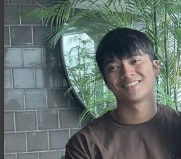

# About Us

We are a team based in the [School of Computing, National University of Singapore](http://www.comp.nus.edu.sg).

You can reach us at the email `seer[at]comp.nus.edu.sg`

## Project team

### John Doe

[[homepage](http://www.comp.nus.edu.sg/~damithch)]
[[github](https://github.com/johndoe)]
[[portfolio](team/johndoe.md)]

* Role: Project Advisor

### Jane Doe

[[github](http://github.com/johndoe)]
[[portfolio](team/johndoe.md)]

* Role: Team Lead
* Responsibilities: UI

### Foong Hong Yi

[[github](http://github.com/mogmyij)] [[portfolio](team/mogmyij.md)]

* Role: Developer
* Responsibilities: Backend

### Emmanuel Chan Shi Hong

[[github](http://github.com/emmanuel2001)]
[[portfolio](team/emmanuel2001.md)]

* Role: Developer
* Responsibilities: Dev Ops + Threading

### Noel Lim

[[github](http://github.com/Mil-leon)]
[[portfolio](team/mil-leon.md)]

* Role: Developer
* Responsibilities: UI
