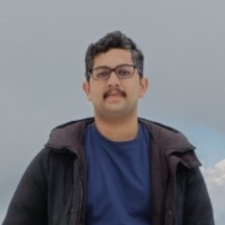
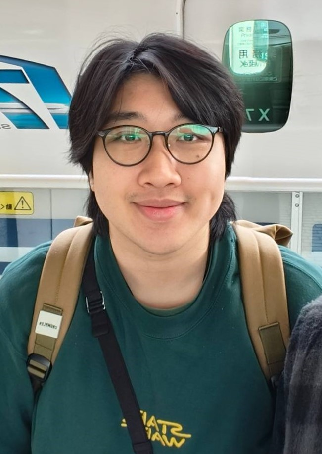

# About Us

We are a team based in the [School of Computing, National University of Singapore](http://www.comp.nus.edu.sg).

## Project team

### Mihir Niyogi

[[github](https://github.com/mihirniyogi)]
[[portfolio](team/mihirniyogi.md)]

* Role: Developer

### Nigel Chan

[[github](http://github.com/cyhni)]
[[portfolio](team/cyhni.md)]

* Role: Team Baker
* Responsibilities: Baking

### Foong Hong Yi

[[github](http://github.com/mogmyij)] [[portfolio](team/mogmyij.md)]

* Role: Developer
* Responsibilities: Backend

### Emmanuel Chan Shi Hong

[[github](http://github.com/emmanuel2001)]
[[portfolio](team/emmanuel2001.md)]

* Role: Developer
* Responsibilities: Dev Ops + Threading

### Noel Lim

[[github](http://github.com/Mil-leon)]
[[portfolio](team/mil-leon.md)]

* Role: Developer
* Responsibilities: UI
