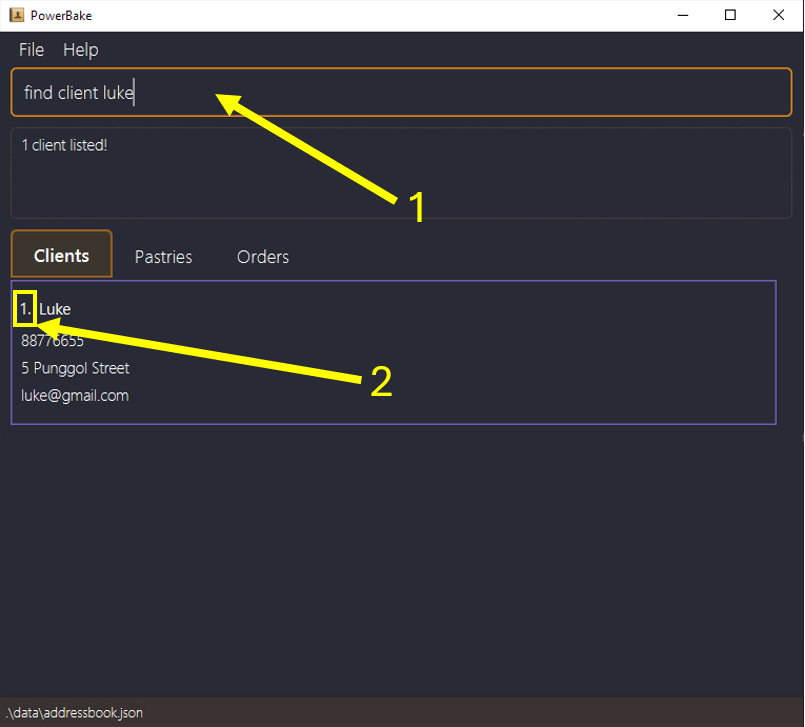
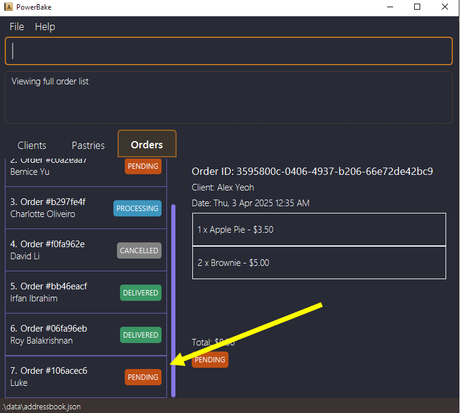
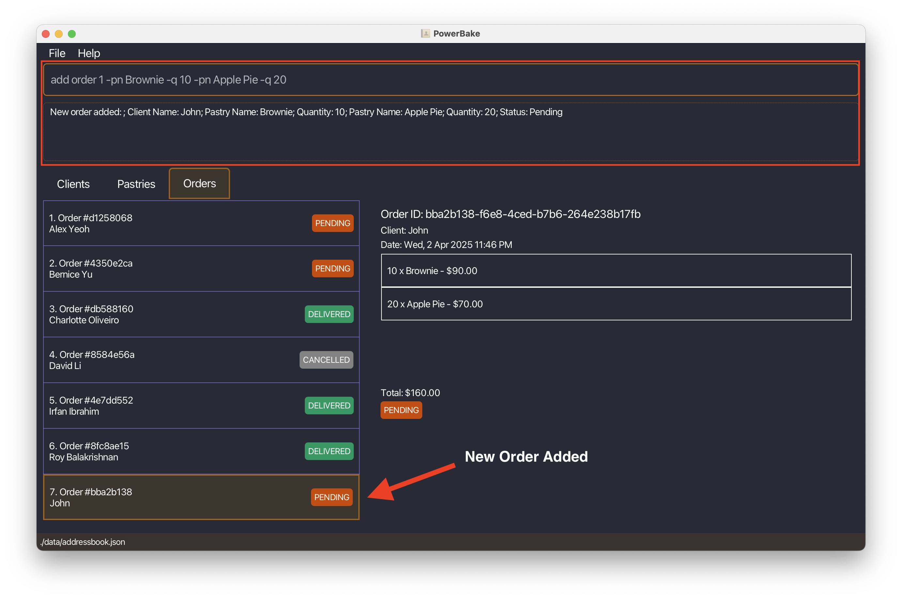
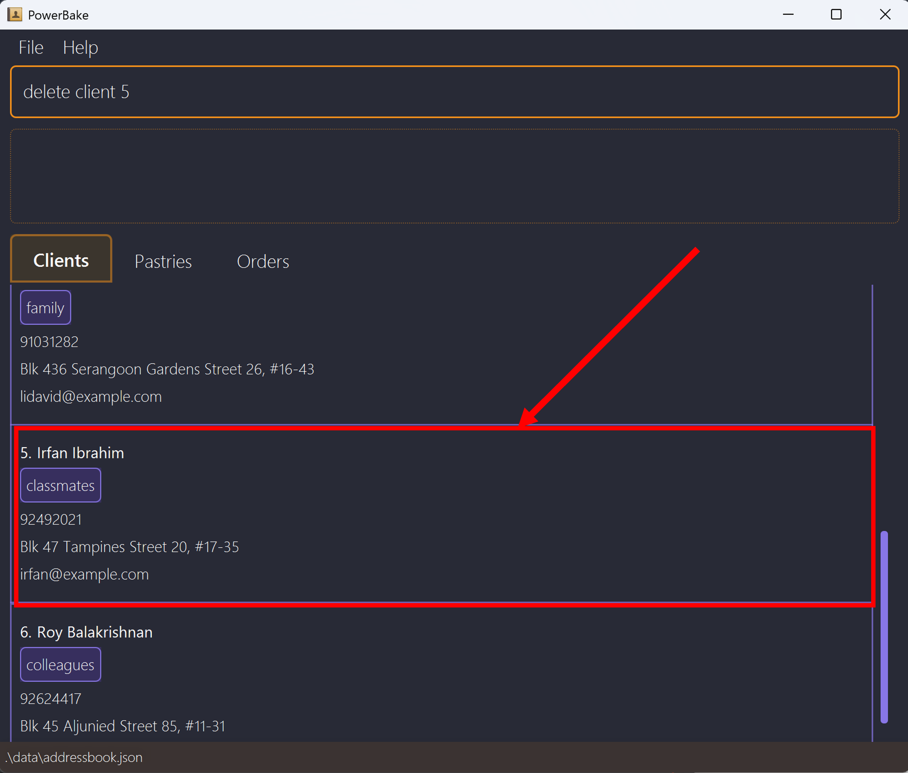
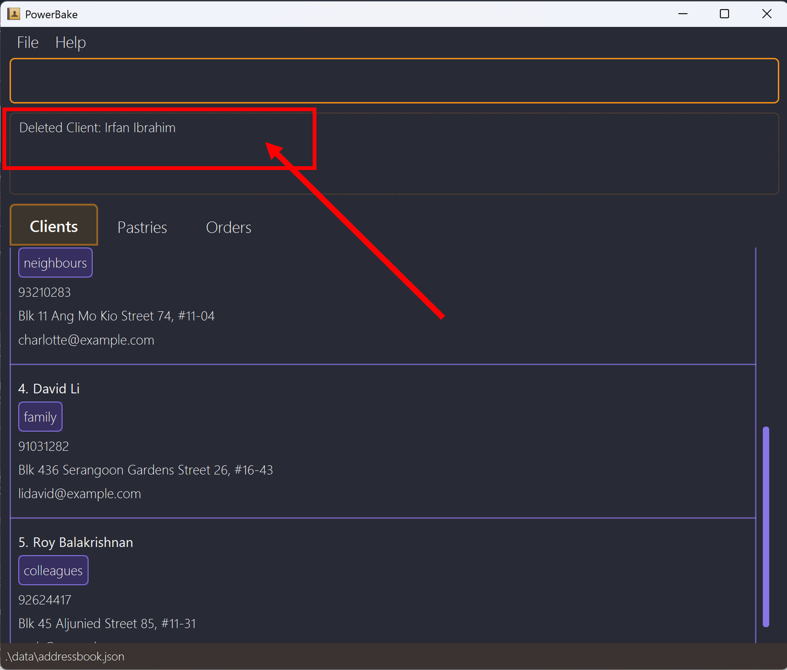
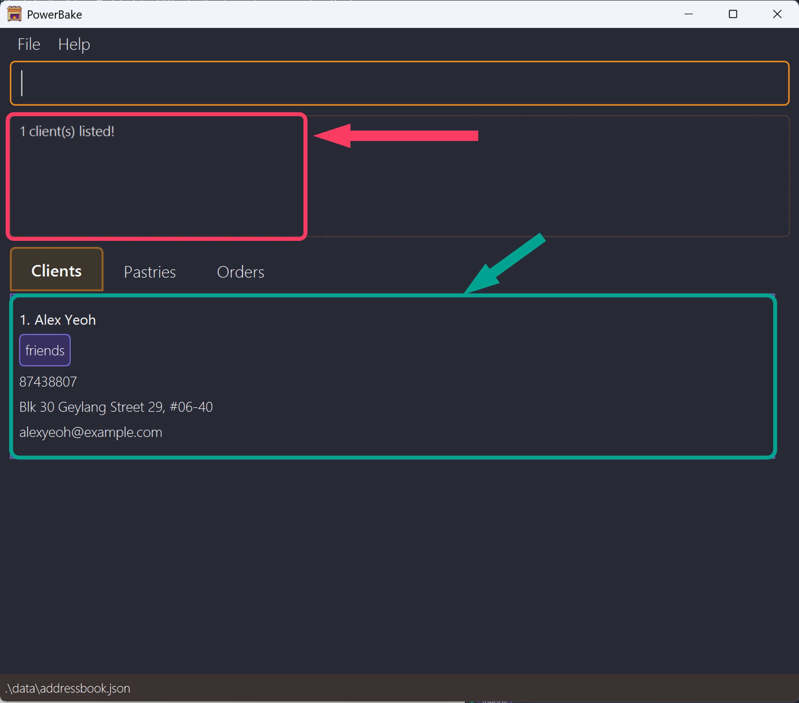
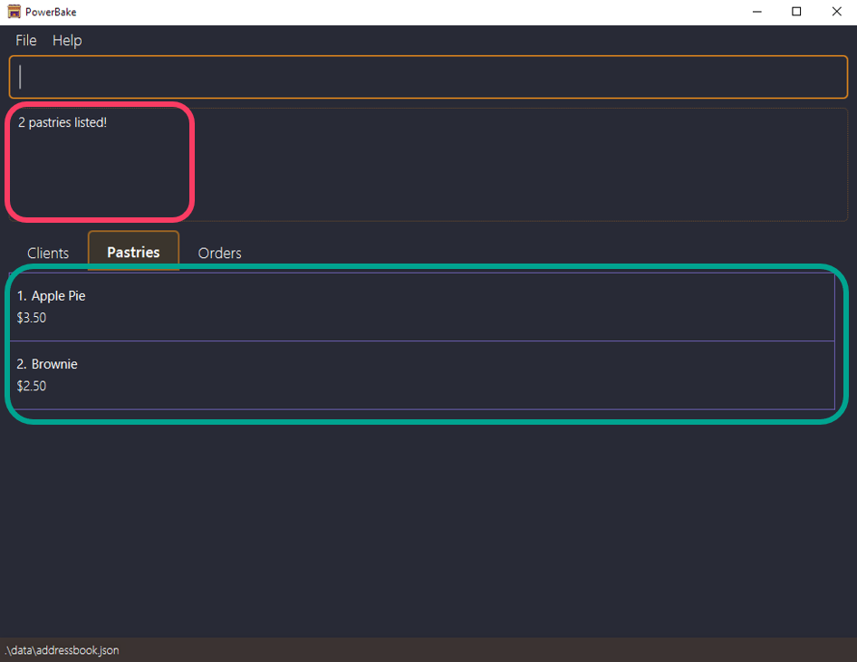
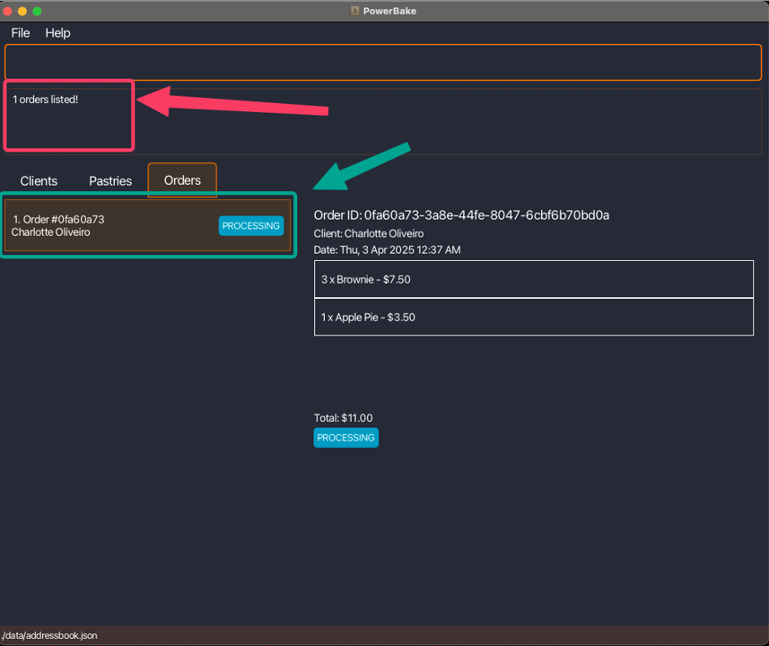
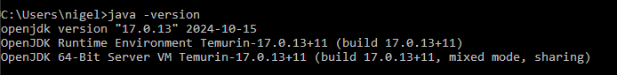

# PowerBake User Guide

<page-nav-print />

<div style="page-break-after: always;"></div>

## **Introduction**


**_PowerBake_** is a **desktop application** designed to help small home bakery businesses **track clients, manage pastry inventory, and organize orders efficiently**.

<br>Using **_PowerBake_**, you can efficiently manage your bakery with:

- **Quick Overview**: Instantly access client details, pastry details, and order statuses at a glance.
- **Order Tracking**: Keep track of each order's progress, from placement to delivery or pickup.
- **Ease of use**: Intuitive and simple commands that anyone can pick up.

To enhance speed and productivity, **_PowerBake_** is **optimized for a [Command Line Interface (CLI)](UserGuide.html#glossary)** while still providing the benefits of a [Graphical User Interface (GUI)](UserGuide.html#glossary).

<box type="info" seamless>

If you type quickly, **_PowerBake_** helps you process orders and manage your business faster than traditional GUI-based applications.

</box>

[^ Back to top](#powerbake-user-guide)

---

<div style="page-break-after: always;"></div>

#### Prerequisite Knowledge

This guide is designed to be accessible to all users, whether you’re a new or experienced user.

If you are a **new _PowerBake_** user:

- Do refer to the [Glossary](#glossary) section to understand the key terminologies used in the guide.
- Check out our [Getting Started](#getting-started) section to get started with using **_PowerBake_**!

If you are an **experienced _PowerBake_** user:

- The [Command Summary](#command-summary) section provides a quick overview of all available commands in **_PowerBake_**.
- The [Features](#features) section can give more specific insight as to the features of **_PowerBake_** and each command.

Our goal is to make managing your bakery as smooth and efficient as possible, regardless of your level of experience.

**For additional information**, you may refer to the [FAQ](#faq) section or the [Known Issues](#known-issues) section.

<box type="warning">

Please note that this application was developed with Singapore-specific context in mind, so certain constraints or limitations may be unique to Singapore.

</box>

[^ Back to top](#powerbake-user-guide)

__________________________________________________________________________________________________________________

<div style="page-break-after: always;"></div>

## **Understanding the User Guide**

This section outlines the various elements found in this guide and explains what they represent.

#### Additional Info

Additional information are shown as a box with a **"i"** symbol.

<box type="info" seamless>

This is an example of additional information.
</box>

#### Warnings

Warnings are shown typically as a box with an exclamation mark as a symbol.

<box type="warning">

This is another warning style. Be careful!
</box>

#### Tips

Similarly, tips are shown within a box with a lightbulb as its symbol.

<box type="tip">

This is a tip you can follow for your convenience!
</box>

[^ Back to top](#powerbake-user-guide)

__________________________________________________________________________________________________________________

<div style="page-break-after: always;"></div>

## Getting Started

Let's learn how to get started with **PowerBake**! This guide will walk you through on how to [**install the application**](#installation) and
[**how to use it**](#tutorial)!

<box header=" **By the end of this section, you will:**">

- Have PowerBake installed on your computer
- Understand how to run PowerBake
- Create your first Customer, Pastry and Order!
- Learn how to manage your Customers and Orders

</box>

[^ Back to top](#powerbake-user-guide)

--------------------------------------------------------------------------------------------------------------------

<div style="page-break-after: always;"></div>

### Installation

1. Ensure you have Java `17` or above installed.

<box type="info" seamless>

**Don't Worry!** If you are not sure how to install java you can follow this [guide](https://www.java.com/en/download/help/download_options.html).

**Mac users:** Ensure you have the precise JDK version prescribed [here](https://se-education.org/guides/tutorials/javaInstallationMac.html).

</box>

2. Download the **latest** `powerbake.jar` file from our [Github's latest release](https://github.com/AY2425S2-CS2103T-F13-2/tp/releases/latest).

3. Find the file you have just downloaded. It is called `powerbake.jar`.

4. Create a new folder to use as the [_home folder_](#glossary) for PowerBake.

    - It is recommended to use a new & empty folder to prevent any data loss.
    - This folder can be created anywhere on your computer.
<p></p>

5. Copy the file to the newly created folder.

    <box type="info" seamless header="**How to copy the file into the new folder:**">

    1. Right click on ```powerbake.jar``` and select **Copy**.

    1. **Navigate** to the newly created folder.

    1. Right click on the folder and select **Paste**.
    </box>

6. **At the end you should have an empty folder with the `powerbake.jar` file in it similar to this:**

    

[^ Back to top](#powerbake-user-guide)

--------------------------------------------------------------------------------------------------------------------
<div style="page-break-after: always;"></div>

### Starting PowerBake

Now that you have installed PowerBake, lets learn how to launch it!

1. Open a [command terminal](#glossary)
    - **Windows:** open the start menu and search for `cmd` then press `Enter`
    - **MacOS:** open spotlight search and search for `Terminal` then press `Enter`
    - **Linux** press `Ctrl + Alt + T` to open the command terminal.

    <br>

    <box type="info" seamless header="**How to use the terminal:**">

    If you are unsure about how to use the terminal you can follow this [guide](https://cs.colby.edu/maxwell/courses/tutorials/terminal).

    </box>

1. Navigate into the folder you created earlier.

    <box type="info" seamless header="**How to navigate into the folder:**">

    1. Open the command terminal.

    1. Type `cd ` (with a space after `cd`).

    1. Drag the folder into the terminal window.

    1. Press `Enter`.

    </box>

1. Run the following command to start PowerBake:

    ```
    java -jar powerbake.jar
    ```

<div style="page-break-after: always;"></div>

4. After a brief moment, you should see a window similar to this:

    

    <box type="info" seamless>

    The first time you run PowerBake, it will contain **sample data**.<br>
    This helps you understand how the entries will appear and how the app will feel like when you start using it.

    </box>

    | Index | Component Name              | Description                                                   |
    |-------|-----------------------------|---------------------------------------------------------------|
    |1      | Command Box                 | You can type commands here and press `Enter` to execute them. |
    |2      | Result Display Box          | Displays the result of executing a command.                   |
    |3      | Current View                | Displays which tab you are currently viewing                  |
    |4      | List View                   | Displays the information of the tab you have currently open   |

Now that you have PowerBake running, lets learn how to use it to manage your customers and orders in this [tutorial!](#tutorial)

[^ Back to top](#powerbake-user-guide)

--------------------------------------------------------------------------------------------------------------------

<div style="page-break-after: always;"></div>

## Tutorial

### Managing your Bakery with PowerBake!

This tutorial will guide you through the process of managing your bakery with **PowerBake**. When you're done you'll be familiar with the typical workflow of PowerBake!

### Step 1: Adding a Client

**Purpose:** Before we can start managing our bakery, we need to have a list of our [clients](#glossary).

Imagine you have a a new client, **Luke**, who has just placed an order with you. Lets add him to PowerBake!

To add him to PowerBake, use this command in the Command Box

```
add client Luke -p 88776655 -a 5 Punggol Street -e luke@gmail.com
```

This command specifies the following details about Luke:
- **Name:** Luke
- **Phone Number:** 88776655 using the ```-p``` flag
- **Address:** 5 Punggol Street using the ```-a``` flag
- **Email**: luke@gmail.com using the ```-e``` flag

After hitting `Enter`, you should see a message indicating that Luke has been successfully added to PowerBake and the new entry should appear in the List View.


1. The **Result Display Box** will show a message indicating that Luke has been successfully added.
1. The **List View** will display the details of Luke.

**Congrats!** You have successfully added your first client to PowerBake!

### Step 2: Adding a Pastry

**Purpose:** Now that we have a client, we need to add the pastries that we offer to our clients.

So far we have created new a new client, **Luke**. Now, lets add a new pastry, **Croissant**, to PowerBake!

To add the Croissant to PowerBake, use this command in the Command Box and hit Enter:

```
add pastry Croissant -pr 5.5
```

This command specifies the following details about the Croissant:
- **Pastry Name:** Croissant
- **Price:** $5.50 using the ```-pr``` flag

Hitting Enter will display a message indicating that the Croissant has been **successfully added** to PowerBake and the new entry should appear in the List View.


1. The **Result Display Box** will show a message indicating that the Croissant has been successfully added.
1. The **List View** will display the details of the Croissant.

**Nice!** You have successfully added your **first pastry** to PowerBake!

<div style="page-break-after: always;"></div>


### Step 3: Adding an Order

**Purpose:** Now that we have a **client** and a **pastry**, we can start taking **orders!**

Lets say **Luke** has placed an order for 2 **Croissants** and 2 **Apple Pies**. Lets add this order to PowerBake!

First, we have to find the **index** of the client Luke using the command in the Command Box:

```
find client luke
```



Here we find that the index of luke is **1**!

<box type="warning">

Do note that when using the `find` command, the indexes of clients may change. 

Make sure the index you use in the next step corresponds to the correctly in the list to the client you want to edit!

</box>

<div style="page-break-after: always;"></div>

To add the order to PowerBake, use this command in the Command Box and hit Enter:

```
add order 1 -pn Croissant -q 2 -pn Apple Pie -q 2
```

<box type="tip">

You can add multiple pastries in a single order by sequentialy specifying the pastry and quantity for each pastry by using the ```-pn``` and ```-q``` flags.

**For Example:** ```add order 1 -pn Croissant -q 2 -pn Apple Pie -q 2 -pn Tart -q 3 ...```

</box>

This command specifies the following details about the order:
- **Client:** Luke using the **index** of the client
- **Pastry:** Croissant using the ```-pn``` flag
- **Quantity:** 2 using the ```-q``` flag

Hitting Enter will display a message indicating that the order has been **successfully added** to PowerBake.


<div style="page-break-after: always;"></div>

You can then view the order list using the command or clicking on the **order** tab:

```
view order
```

You can view the order in detail by finding the order index in the GUI and typing:
```
view order INDEX
```



<box type="info" seamless>

New Orders **automatically** have the status of **Pending**.

</box>

1. The **Result Display Box** will show a message indicating that the order has been successfully added.
1. The **List View** will display the details of the order.

**Good Job!** You have successfully added your **first order** to PowerBake! With this knowledge, you can now manage your bakery efficiently!

### Step 4: Clearing PowerBake

This step is optional but if you wish to start with a clean slate, use the following command in the Command Box:

```
clear
```
<box type="warning">

Do be careful, as this command irreversibly deletes ALL entries. This the operation cannot be undone.

</box>

[^ Back to top](#powerbake-user-guide)

--------------------------------------------------------------------------------------------------------------------

<div style="page-break-after: always;"></div>

## Features

This section explains the detailed list of commands and its usages which are available for you to use.

<box type="tip">

If you are familiar with **_PowerBake_** and just need a **quick refresher** on the commands available, you can [click here](#command-summary) for the Command Summary below.

</box>

<box type="info" seamless>

**Notes about the command format:**<br>

* Words in `UPPER_CASE` are the parameters to be supplied by the user.<br>
  ```
   add client NAME -p PHONE -a ADDRESS -e EMAIL [-t TAGS]
  ```
  `NAME`, `ADDRESS`, `EMAIL`, `PHONE` and `TAGS` are parameters which are to be replaced:
  ```
   add client Luke -p 88776655 -a 5 Punggol Street -e luke@gmail.com -t client
  ```

* Words in `[Square Brackets]` are **optional parameters**.<br>
  ```
   add client NAME -p PHONE -a ADDRESS -e EMAIL [-t TAGS]
  ```
  `TAGS` is optional. You can use it like:
  ```
   add client Luke -p 88776655 -a 5 Punggol Street -e luke@gmail.com -t client
  ```
  OR
  ```
   add client Luke -p 88776655 -a 5 Punggol Street -e luke@gmail.com
  ```

* Extraneous parameters for commands that do not take in parameters (`exit`) will be ignored.<br>
  e.g. if the command specifies `exit 123`, it will be interpreted as `exit`.
</box>

[^ Back to top](#powerbake-user-guide)

---

<div style="page-break-after: always;"></div>

### Parameters

This section covers the different parameters used in **PowerBake** and their respective constraints.

<box type="warning" icon-size="1x">

To make sure commands to work successfully, ensure that all parameters follow the constraints mentioned below.

Characters with accents or diacritics (e.g., à, é, ô, ÿ) as well as those from non-Latin alphabets (e.g., Я (Cyrillic – Russian), あ (Japanese – Hiragana), ض (Arabic)), are currently **not supported**.

</box>

| Parameter         | Description                                                                | Constraints                                                                                                                                                                                                                                                                                                                                                                                                                                                                                                                                                                                                                                                                                                                                                                                                                                                                                                                                                    | Example                                                                                                                                                                                                                                                      |
|-------------------|----------------------------------------------------------------------------|----------------------------------------------------------------------------------------------------------------------------------------------------------------------------------------------------------------------------------------------------------------------------------------------------------------------------------------------------------------------------------------------------------------------------------------------------------------------------------------------------------------------------------------------------------------------------------------------------------------------------------------------------------------------------------------------------------------------------------------------------------------------------------------------------------------------------------------------------------------------------------------------------------------------------------------------------------------|--------------------------------------------------------------------------------------------------------------------------------------------------------------------------------------------------------------------------------------------------------------|
| `NAME`            | The name of your client                                                    | <ul><li>Only letters, numbers, and spaces are permitted.</li><li>This parameter cannot be left blank.</li><li>If you need to include terms like "s/o" or "d/o" in a name, please use alternatives such as "s o" or "son of" instead.</li></ul>                                                                                                                                                                                                                                                                                                                                                                                                                                                                                                                                                                                                                                                                                                                 |:fa-solid-check: <br>`Luke James`<br><br> :fa-solid-xmark: <br>`J@mes`<br>`ジョン ドー`<br>`俊涵`                                                                                                                                                              |
| `ADDRESS`         | The address of your client                                                 | <ul><li>Any characters are allowed.</li><li>This parameter cannot be left blank.</li><li>Only accepts 5 - 100 characters</li></ul>                                                                                                                                                                                                                                                                                                                                                                                                                                                                                                                                                                                                                                                                                                                                                                                                                             |:fa-solid-check: <br>`5 Sengkang Street`<br><br> :fa-solid-xmark:<br>`Blk 3`                                                                                                                                                                                  |
| `EMAIL`           | The email of your client                                                   | <ul><li>Emails should be of the format. `local-part@domain`.</li><li>This parameter cannot be left blank.</li><li>The `local-part` should only contain alphanumeric characters and these **special characters**: `+_.-`</li><li>The `local-part` must not include **special characters** placed consecutively.</li><li>The `local-part` may not start or end with any **special characters**.</li><li>The `domain name` is made up of `domain labels` separated by periods.</li><li>The `domain name` must end with a `domain label` at least 2 characters long</li><li>The `domain` name must each have a domain label start and end with alphanumeric characters</li><li>The `domain name` must each have `domain label` consist of alphanumeric characters, separated only by hyphens, if any.</li><li>The `domain label` that is after the final period cannot be the sequence of characters of `alphanumeric` `hyphen` `alphanumeric` (e.g. c-m)</li></ul>|:fa-solid-check: <br>`luke@gmail.com`<br>`alex.ye_o+h@ex.amp-le.com`<br><br> :fa-solid-xmark:<br>`luk`<br>`lu_+ke@gmail.com`<br>`-luke@gmail.com`<br>`john@example`<br>`nigel@example.c`<br>`mihir@example-.com`<br>`lucas@ex/ample.com`<br>`noel@example.c-m`|
| `PHONE`           | The phone number of your client                                            | <ul><li>Only numbers are allowed. `local-part@domain`.</li><li>This parameter cannot be left blank.</li><li>The `local-part` should only contain alphanumeric characters and these **special characters**: `+_.-`</li><li>Only numbers of 8 digits are allowed.</li></ul>                                                                                                                                                                                                                                                                                                                                                                                                                                                                                                                                                                                                                                                                                      |:fa-solid-check: <br>`12345678`<br><br> :fa-solid-xmark:<br>`+65 1234 5678`                                                                                                                                                                                   |
| `TAG`             | Extra details of your client                                               | <ul><li>Only letters, numbers, and spaces are permitted.</li><li>This parameter is optional.</li></ul>                                                                                                                                                                                                                                                                                                                                                                                                                                                                                                                                                                                                                                                                                                                                                                                                                                                         |:fa-solid-check: <br>`Gluten Free`<br><br> :fa-solid-xmark:<br>`Egg/Cheese Only`                                                                                                                                                                              |
| `PASTRY_NAME`     | The name of your pastry                                                    | <ul><li>Only letters, numbers, and spaces are permitted.</li><li>This parameter cannot be left blank.</li><li>If your pastry name requires accented characters, please use the alphanumerical alternatives instead.</li></ul>                                                                                                                                                                                                                                                                                                                                                                                                                                                                                                                                                                                                                                                                                                                                  |:fa-solid-check: <br>`Chocolate Eclair`<br>`Croissant`<br><br> :fa-solid-xmark:<br>`Chocolate Éclair`                                                                                                                                                         |
| `PRICE`           | The price of your pastry                                                   | <ul><li>Prices should only contain digits and up to 2 decimal points.</li><li>Price can be 0 but must be positive and less than 1000 in value.</li><li>This parameter cannot be left blank.</li></ul>                                                                                                                                                                                                                                                                                                                                                                                                                                                                                                                                                                                                                                                                                                                                                          |:fa-solid-check: <br>`0`<br>`3`<br>`12.5`<br>`0.99`<br>`999.99`<br><br> :fa-solid-xmark:<br>`One hundred`<br>`-1`<br>`1.995`<br>`.99`<br>`1000`                                                                                                               |
| `QUANTITY`        | The number of pastry items ordered                                         | <ul><li>Quantity number should only contain whole digits.</li><li>Quantity number must be positive and less than 1000 in value.</li><li>This parameter cannot be left blank.</li></ul>                                                                                                                                                                                                                                                                                                                                                                                                                                                                                                                                                                                                                                                                                                                                                                         |:fa-solid-check: <br>`1`<br>`999`<br><br> :fa-solid-xmark:<br>`One`<br>`0`<br>`0.9`<br>`1000`<br><br>                                                                                                                                                         |
| `CLIENT_INDEX`    | The index of the client based on the list shown                            | <ul><li>Only whole numbers are permitted.</li><li>Index must be a positive number.</li><li>The index must refer to a valid client in the list shown (i.e., it cannot be out of range).</li><li>This parameter cannot be left blank.</li></ul>                                                                                                                                                                                                                                                                                                                                                                                                                                                                                                                                                                                                                                                                                                                  |:fa-solid-check: <br>`1 (only if client exists)`<br><br> :fa-solid-xmark:<br>`0`<br>`-1`                                                                                                                                                                      |
| `INDEX`           | General index to reference **client/pastry/order** shown on the list       | <ul><li>Only whole numbers are permitted.</li><li>Index must be a positive number.</li><li>The index must refer to a valid **client/pastry/order** in the list shown (i.e., it cannot be out of range).</li><li>This parameter cannot be left blank.</li></ul>                                                                                                                                                                                                                                                                                                                                                                                                                                                                                                                                                                                                                                                                                                 |:fa-solid-check: <br>`1 (only if client/pastry/order exists)`<br><br> :fa-solid-xmark:<br>`0`<br>`-1`                                                                                                                                                         |
| `KEYWORD`         | Used in `find` command to search the relevant **client/pastry/order** list | <ul><li>Any value is allowed.</li><li>This parameter cannot be left blank.</li></ul>                                                                                                                                                                                                                                                                                                                                                                                                                                                                                                                                                                                                                                                                                                                                                                                                                                                                           |:fa-solid-check: <br>`Apple Pie`<br>`John Doe`                                                                                                                                                                                                                |

[^ Back to top](#powerbake-user-guide)

---

<div style="page-break-after: always;"></div>

### Adding a Client: `add client`

The `add client` allows you to seamlessly add key details of your client into the record. These details will then be integrated into keeping track of orders in the future.

#### Command Usage
```
add client NAME -p PHONE -a ADDRESS -e EMAIL [-t TAGS]
```

#### Parameters:

1. `NAME`: The name of your client.
2. `-a ADDRESS`: The address of your client, 5 - 100 characters
3. `-e EMAIL`: The email address of you client, follows valid format
4. `-p PHONE`: 8-digit phone number of your client
5. `-t TAG`: Extra details of your client

Refer to the [Parameters](#parameters) section for more details about the parameters and their individual constraints.

<box type="info" seamless>

- All fields except for `TAG` are compulsory and must be not empty.
- `TAG` can be left blank, you can add as many tags as you want.
- PowerBake checks for duplicate `clients` using `PHONE` number. Adding of duplicate clients will be ignored and an error message will be shown. 

</box>

<div style="page-break-after: always;"></div>

##### Example:
Adding a client, `Luke`, into Powerbake application. He lives at `5 Sengkang Street` and his email address is `luke@gmail.com`. His phone number is `88776655`.

To add luke, simply type:
```
add client Luke -p 88776655 -a 5 Sengkang Street -e luke@gmail.com
```

Once `enter` is hit, a output message will be displayed of your success.


<br>
<box type="tip">

You can use the [`edit` command](#editing-client-pastry-or-order-details--edit) to change the client details if you made a mistake here.

</box>

[^ Back to top](#powerbake-user-guide)

---

<div style="page-break-after: always;"></div>

### Adding a Pastry: `add pastry`

The `add pastry` command allows you to add key details of pastries. These details will then utilised when keeping track of pastry orders in the future.

#### Command Usage
```
add pastry PASTRY_NAME -pr PRICE
```

#### Parameters:

1. `PASTRY_NAME`: The name of your pastry.
2. `-pr PRICE`: The price of your pastry, supports up to 2 decimal places.

Refer to the [Parameters](#parameters) section for more details about the parameters and their individual constraints.

<box type="info" seamless>

- All fields are compulsory and must not be empty.
- PowerBake checks for duplicate `pastry` using `PASTRY_NAME`, this check is case-insensitive. Adding of duplicate pastries will be ignored and an error message will be shown. 

</box>

<div style="page-break-after: always;"></div>

##### Example:
Adding a pastry, `Croissant`, into PowerBake application. Price is `5.50`.

To add the Croissant, simply type
```
add pastry Croissant -pr 5.5
```

Once `enter` is hit, a output message will be displayed of your success.


<br>
<box type="tip">

You can use the [`edit` command](#editing-client-pastry-or-order-details--edit) to change the pastry details if you made a mistake here.

</box>

[^ Back to top](#powerbake-user-guide)

---
<div style="page-break-after: always;"></div>

### Adding an order: `add order`

The `add order` command allows you to create orders for clients with their ordered pastries.

#### Command Usage
```
add order CLIENT_INDEX -pn PASTRY_NAME -q QUANTITY [-pn PASTRY_NAME -q QUANTITY]
```

#### Parameters:

1. `CLIENT_INDEX`: The index of the client based on the list shown
2. `-pn PASTRY_NAME`: The name of the pastry to be added
3. `-q Quantity`: The quantity of pastry to be added to the order

Refer to the [Parameters](#parameters) section for more details about the parameters and their individual constraints.

<box type="info" seamless>

- All orders added are always considered unique.

</box>

<box type="tip">

You can add multiple pastries in a single order by sequentialy specifying the pastry and quantity for each pastry by using the ```-pn``` and ```-q``` flags.

**For Example:** ```add order 1 -pn Croissant -q 2 -pn Apple Pie -q 2 -pn Tart -q 3 ...```

</box>

<div style="page-break-after: always;"></div>

##### Example:
Adding an order for client `1` an order of `10 Brownie` and `20 Apple Pie` into PowerBake application.

To add the Croissant, simply type
```
add order 1 -pn Brownie -q 10 -pn Apple Pie -q 20
```

Once `enter` is hit, a output message will be displayed of your success.



<br>
<box type="tip">

PowerBake assumes that once an order is created, it has been mutually agreed upon and is intended solely for fulfillment.

Therefore, if you made a mistake here, you should use the [`delete` command](#deleting-client-pastry-or-order-delete) and add the correct order again.

You can use the [`edit` command](#editing-client-pastry-or-order-details--edit) to change **only the status** of the order.

</box>

[^ Back to top](#powerbake-user-guide)

---

<div style="page-break-after: always;"></div>

### Deleting Client, Pastry or Order: `delete`

The `delete` command helps you maintain a clean and relevant list of clients, pastries and orders.

#### Command Usage

```
delete client/pastry/order INDEX
```

#### Parameters:

1. `INDEX`: Represents position of the client/pastry/order list that you wish to remove.

Refer to the [Parameters](#parameters) section for more details about the parameters and their individual constraints.


<box type="info" seamless>

- The `INDEX` should be positive integer. For instance: `1`, `2`, etc. </br>
This corresponds to the position of the client/pastry/order currently displayed in the list.
- Deleting a `client` or a `pastry` will not delete the related `order`. 
<br>The reasoning behind this is that PowerBake assumes that orders are mutually agreed upon creation and are purely meant for tracking order fufillment, therefore, the order should maintain its integrity using its original form.

</box>

<box type="warning">

Do be careful, as this command irreversibly deletes the selected entry. This the operation cannot be undone.

</box>

<div style="page-break-after: always;"></div>

##### Example 1:
If you want to remove the fifth **client** on the list, the command would look like this:

```
 delete client 5
```

**Before:**


After hitting `Enter`, you will see the fifth client removed from the list.
The remaining clients will adjust their index numbers accordingly.

**After:**


<div style="page-break-after: always;"></div>

##### Example 2:
If you want to remove the second **pastry** on the list, the command would look like this:

```
 delete pastry 2
```

After hitting `Enter`, you will see the second pastry removed from the list.
The remaining pastries will adjust their index numbers accordingly.

##### Example 3:
If you want to remove the **third** order on the list, the command would look like this:

```
 delete order 3
```

After hitting `Enter`, you will see the third order removed from the list.
The remaining orders will adjust their index numbers accordingly.

[^ Back to top](#powerbake-user-guide)

---

<div style="page-break-after: always;"></div>

### Editing Client, Pastry or Order Details : `edit`

The `edit` command offers flexibility in managing details of Clients, Pastries or Orders in PowerBake.

#### Command Usage

To edit **Client** details: </br>
```
edit client INDEX [-n NAME] [-p PHONE] [-e EMAIL] [-a ADDRESS] [-t TAGS]
```

To edit **Pastry** details: </br>
```
edit pastry INDEX [-n PASTRY_NAME] [-pr PRICE]
```

To edit **Order** details: </br>
```
edit order INDEX -s STATUS
```

#### Parameters:

1. `INDEX`: Represents position of the **client/pastry/order** list that you wish to edit.
2. `-n NAME`: New name for your **client/pastry** that you wish to edit to
3. `-p PHONE`: New phone number for your **client** that you wish to change
4. `-e EMAIL`: New email for your **client** that you wish to use
5. `-a ADDRESS`: New address for your **client** that you wish to update
6. `-t TAGS`: New tags for your **client** to be associated with the client
7. `-n PASTRY_NAME`: New **pastry** name to be edited to
8. `-pr PRICE`: New price of the **pastry** to be updated to
9. `-s STATUS`: New Status of the **order** to be updated to

Refer to the [Parameters](#parameters) section for more details about the parameters and their individual constraints.

<box type="info" seamless>

- The `INDEX` should be positive integer. For instance: `1`, `2`, etc. </br>
This corresponds to the position of the client/pastry/order currently displayed in the list.

- At least one field needs to be edited.

- Editing `client` will update the related `orders` to allow update of contact details. However, editing a `pastry` will not update the values in the related `orders`.
<br>This is to maintain the integrity of the original order details, ensuring that what was agreed upon at the time of ordering remains unchanged, even if the pastry's information is later modified.

</box>

##### Example 1:
If you want to edit the name and phone of the first client on the list, the command would look like this:

```
 edit client 1 -n John -p 97432170
```

After hitting `Enter`, you will see the first client edited on the list.


##### Example 2:
If you want to edit the price of the second **pastry** on the list, the command would look like this:

```
 edit pastry 2 -pr 9.00
```

After hitting `Enter`, you will see the second pastry updated from the list.


##### Example 3:
If you want to edit the status of the third **order** on the list, the command would look like this:

```
 edit order 3 -s delivered
```

After hitting `Enter`, you will see the third order updated from the list.

[^ Back to top](#powerbake-user-guide)

---

<div style="page-break-after: always;"></div>

### Viewing Client, Pastry or Order : `view`

The `view` command offers a detailed insight of the client, pastry and order lists.

An in-depth look to access client information, types of pastries available and orders made thus far.

#### Command Usage

To view the various tabs:
```
view client/pastry/order
```
To view specific order:
```
view order INDEX
```

#### Parameters:

1. `client`: Access the client list.
2. `pastry`: Access the pastry list.
3. `order`: Access the order list.
4. `INDEX`: The order index shown on the list that you wish to view.

Refer to the [Parameters](#parameters) section for more details about the parameters and their individual constraints.

<box type="info" seamless>

The `view` command allows only either viewing client, or viewing pastry, or viewing order or viewing specific orders.

The `INDEX` should be positive integer. For instance: `1`, `2`, etc. </br>
This corresponds to the position of the client/pastry displayed in list.

</box>

<div style="page-break-after: always;"></div>

##### Example 1:
If you wish to view the `client` details, the command would be:

```
 view client
```

After hitting `Enter`, you will see the client details being displayed on the GUI. </br>

Here, you can observe all the details regarding client, such as their name, address, email address, phone number and tag.

##### Example 2:
If you wish to view the `pastry` details, the command would be:

```
 view pastry
```

After hitting `Enter`, you will see the pastry details being displayed on the GUI. </br>


Here, you can observe all the details regarding pastry, such as the name and the price of the pastry.

##### Example 3:
If you wish to view the `order` details, the command would be:

```
 view order
```

After hitting `Enter`, you will see the order details being displayed on the GUI. </br>

Here, you can observe the general details regarding order, such as their order number, client name, status.

<div style="page-break-after: always;"></div>

##### Example 4:
If you wish to view the specific `order` details, the command would be:

```
 view order INDEX
```

After hitting `Enter`, you will see the order details being displayed on the GUI. </br>

Here, you can observe all the details regarding order, such as their order number, client name, pastry name, quantity and status.

<box type="tip">

You can also use the keyboard shortcut of `Ctrl + Tab` to tab between view tabs.

</box>

<box type="tip">

Alternatively, you can switch between **client**, **pastry** and **order** by utilising the GUI button.


</box>

[^ Back to top](#powerbake-user-guide)

---

<div style="page-break-after: always;"></div>

### Find Client, Pastry or Order : `find`

The `find` command is a powerful tool to help you quickly search and locate specific client/pastry/order in PowerBake.

#### Command Usage

```
find client/pastry/order KEYWORD [MORE_KEYWORDS]
```

#### Parameters:

1. `client/pastry/order`: Represents which type of entity you wish to find from.
2. `KEYWORD`: Returns searches that matches or partially matching to the keyword

Refer to the [Parameters](#parameters) section for more details about the parameters and their individual constraints.

<box type="info" seamless>

- At least one keyword needs to be provided.
- The matching is case-insensitive.
- The order of the keywords does not matter. e.g. `Hans Bo` will match `Bo Hans`
- Entry matching at least one keyword will be returned (i.e. OR search). 
    - e.g. `Hans Bo` will return `Hans Gruber`, `Bo Yang`
- Finds the `client/pastry/order` with matching or partially matching `KEYWORD`.
    - e.g `ha` will still return `Hans Bo`
- `find order` searches based on the `NAME` of the `client` who placed the order.

</box>

<box type="warning">

When you use the `find` command, it filters the list and displays only matching entries, which may change the order and number of items shown. 
<br>As a result, the indexes in this filtered list will differ from those in the original, unfiltered list.
<br>Therefore, any command that uses `INDEX` or `CLIENT_INDEX` must refer to the index as shown in the currently displayed (filtered) list — not the full list — to ensure it targets the correct entry.

</box>

<box type="tip">

To reset any of the list use the **[view](#viewing-client-pastry-or-order-view)** command!

</box>

<div style="page-break-after: always;"></div>

##### Example 1:
If you want to find the name of the first client on the list, the command would look like this:

```
find client Alex
```
OR
```
find client lex
```

After hitting `Enter`, the list will return `Alex Yeoh`.



<div style="page-break-after: always;"></div>

##### Example 2:
If you want to find name of the **Brownie and Apple Pie pastry** on the list, the command would look like this:

```
find pastry Brownie Apple
```

After hitting `Enter`, the list will be updated to match the search.



<div style="page-break-after: always;"></div>


##### Example 3:
If you want to find the **order** that belongs to a **client** on the list, the command would look like this:

```
find order Charlotte
```

After hitting `Enter`, you will see the only the orders that belongs to **Charlotte** shows up.




[^ Back to top](#powerbake-user-guide)

---

<div style="page-break-after: always;"></div>

### Clearing all entries : `clear`

The `clear` command **deletes** all clients, pastries and orders in PowerBake.

#### Command Usage

```
clear
```

#### Parameters:

<box type="info" seamless>

The `clear` command does not require any parameters.

</box>

<box type="warning">

Do be careful, as this command irreversibly deletes ALL entries. This the operation cannot be undone.

</box>

[^ Back to top](#powerbake-user-guide)

---

<div style="page-break-after: always;"></div>

### Getting help : `help`

The `help` command provide popup message showing how to access this **User Guide**.

#### Command Usage

```
help
```

#### Parameters:

<box type="info" seamless>

The `help` command does not require any parameters.

</box>

<box type="tip">

You can also get help by clicking on the `Help` button or pressing `F1` on your keyboard.

</box>

[^ Back to top](#powerbake-user-guide)

---

<div style="page-break-after: always;"></div>

### Exiting the program : `exit`

The `exit` command lets you have a swift way of **closing PowerBake**.

It is a simple command, where the application terminates while safeguarding all the data and changes you have made.

#### Command Usage

```
exit
```

#### Parameters:

<box type="info" seamless>

The `exit` command does not require any parameters.

</box>

[^ Back to top](#powerbake-user-guide)

---

<div style="page-break-after: always;"></div>

## Storage

This section will go through how order, pastry and customer details are stored.

### Saving Data

*PowerBake* data is saved automatically after any command that adds, deletes or edit. There is no need for any manual saving.


### Editing the Data File
**CAUTION:**
Adding data in the wrong format could lead to potential errors.

*PowerBake* data is saved in `[JAR file location]/data/addressbook.json`, experienced users can add or delete clients and pastries within the json file.

**Caution:**
If your changes to the data file makes its format invalid, PowerBake will discard all data and start with an empty data file at the next run.  Hence, it is recommended to take a backup of the file before editing it.<br>
Furthermore, certain edits can cause the PowerBake to behave in unexpected ways (e.g., if a value entered is outside the acceptable range). Therefore, edit the data file only if you are confident that you can update it correctly.
</box>

[^ Back to top](#powerbake-user-guide)

--------------------------------------------------------------------------------------------------------------------

<div style="page-break-after: always;"></div>

## FAQ

##### **Q**: Do you support languages other than English?
- **A**: There is currently no support for languages other than English. This also means you will not be able to use non-English inputs.<br>We plan to work on this in the future! Stay tuned!

##### **Q**: How do I check my Java version?
- **A**: Open up your command terminal and enter the following command:
```
java -version
```
###### You should see something like this
<box>


The command will display `openjdk version 17.0.13` or `java version 17.0.13` on the first line of the output, indicating that Java 17 is installed. The minor version numbers (the last two digits) may differ from ours.
</box>

##### **Q**: How do I open up the command terminal?
- **A**: 
    - **Windows:** open the start menu and search for `cmd` then press `Enter`
    - **MacOS:** open spotlight search and search for `Terminal` then press `Enter`
    - **Linux** press `Ctrl + Alt + T` to open the command terminal.


##### **Q**: How do I transfer my data to another Computer?
- **A**: Install the app in the other computer and overwrite the empty data file it creates with the file that contains the data of your previous PowerBake home folder.

##### **Q**: Can I use two instances of PowerBake simultaneously on the same computer? 
- **A**: Currently we advise against using more than one instance of PowerBake at a single time as it may lead to data lost and corruption between the two instances.

[^ Back to top](#powerbake-user-guide)

--------------------------------------------------------------------------------------------------------------------

<div style="page-break-after: always;"></div>

## Known issues

1. **When using multiple screens**, if you move the application to a secondary screen, and later switch to using only the primary screen, the GUI will open off-screen. The remedy is to delete the `preferences.json` file created by the application before running the application again.
2. **If you minimize the Help Window** and then run the `help` command (or use the `Help` menu, or the keyboard shortcut `F1`) again, the original Help Window will remain minimized, and no new Help Window will appear. The remedy is to manually restore the minimized Help Window.

[^ Back to top](#powerbake-user-guide)

--------------------------------------------------------------------------------------------------------------------

<div style="page-break-after: always;"></div>

## Command summary
| Command                                                         | Usage                                                                                 | Example                                                                       |
|-----------------------------------------------------------------|---------------------------------------------------------------------------------------|-------------------------------------------------------------------------------|
| **[Add Client](#adding-a-client-add-client)**                   | `add client NAME -p PHONE -a ADDRESS -e EMAIL [-t TAGS]`                              | `add client Luke -a 5 Punggol Street -e luke@gmail.com -p 88776655 -t client` |
| **[Add Pastry](#adding-a-pastry-add-pastry)**                   | `add pastry PASTRY_NAME -pr PRICE`                                                    | `add pastry Tart -pr 3.40`                                                    |
| **[Add Order](#adding-an-order-add-order)**                      | `add order CLIENT_INDEX -pn PASTRY_NAME -q QUANTITY [-pn PASTRY_NAME -q QUANTITY]`    | `add order 1 -pn Brownie -q 10 -pn Apple Pie -q 20`                           |
| **[Delete Client](#deleting-client-pastry-or-order-delete)**    | `delete client INDEX`                                                                 | `delete client 1`                                                             |
| **[Delete Pastry](#deleting-client-pastry-or-order-delete)**    | `delete pastry INDEX`                                                                 | `delete pastry 1`                                                             |
| **[Delete Order](#deleting-client-pastry-or-order-delete)**     | `delete order INDEX`                                                                  | `delete order 1`                                                              |
| **[Edit Client](#editing-client-pastry-or-order-details-edit)** | `edit client INDEX [-n NAME] [-p PHONE] [-e EMAIL] [-a ADDRESS] [-t TAGS]`            | `edit client 1 -n John -p 97432170`                                           |
| **[Edit Pastry](#editing-client-pastry-or-order-details-edit)** | `edit pastry INDEX [-n PASTRY_NAME] [-pr PRICE]`                                      | `edit pastry 2 -pr 9.00`                                                      |
| **[Edit Order](#editing-client-pastry-or-order-details-edit)**  | `edit order INDEX -s STATUS`                                                          | `edit order 3 -s delivered`                                                   |
| **[View Client](#viewing-client-pastry-or-order-view)**         | `view client`                                                                         | `view client`                                                                 |
| **[View Pastry](#viewing-client-pastry-or-order-view)**         | `view pastry`                                                                         | `view pastry`                                                                 |
| **[View Order](#viewing-client-pastry-or-order-view)**          | `view order`                                                                          | `view order`                                                                  |
| **[View Specific Order](#viewing-client-pastry-or-order-view)** | `view order INDEX`                                                                    | `view order 1`                                                                |
| **[Find Client](#find-client-pastry-or-order-find)**            | `find client KEYWORD [MORE_KEYWORD]`                                                  | `find client Alex`                                                            |
| **[Find Pastry](#find-client-pastry-or-order-find)**            | `find pastry KEYWORD [MORE_KEYWORD]`                                                  | `find pastry Brownie`                                                         |
| **[Find Order](#find-client-pastry-or-order-find)**             | `find order KEYWORD [MORE_KEYWORD]`                                                   | `find order Charlotte`                                                        |
| **[Clear](#clearing-all-entries-clear)**                        | `clear`                                                                               | `clear`                                                                       |
| **[Help](#getting-help-help)**                                  | `help`                                                                                | `help`                                                                       |
| **[Exit](#exiting-the-program-exit)**                           | `exit`                                                                                | `exit`                                                                        |

[^ Back to top](#powerbake-user-guide)

--------------------------------------------------------------------------------------------------------------------

<div style="page-break-after: always;"></div>

## Glossary

| Term                              | Explanation                                                                                                                                                                                                    |
|-----------------------------------|----------------------------------------------------------------------------------------------------------------------------------------------------------------------------------------------------------------|
| Client/Customer                   | A client/customer in a bakery is a regular or business customer who places orders for baked goods, often in bulk or on a recurring basis.                                                                      |
| Command                           | A user input that directs Powerbake to carry out a particular action.                                                                                                                                       |
| Command Line Interface (CLI)      | An interface where users interact with a system by entering text commands into a terminal or console.                                                                                                          |
| Command Terminal                  | A text-based interface for interacting with the computer. Examples include the Command Prompt on Windows, Terminal on macOS, and bash on Linux.                                                                |
| Graphical User Interface (GUI)    | An interface that enables users to engage with a system using visual elements like icons and other graphical indicators.                                                                                       |
| Home Folder                       | The folder where Powerbake is saved. The home folder is used to store data files used by Powerbake.                                                                                                         |
| Hyperlink                         | A clickable reference on a webpage that directs users to another location or file, either on the same page or a different one.                                                                                 |
| JSON (JavaScript Object Notation) | A simple, human-readable data format used for data exchange that is easily parsed and generated by machines.                                                                                                   |
| Local Storage                     | Local storage in an application refers to a method of storing data on a user's device, allowing the application to save information persistently without requiring a server connection.                        |
| Mainstream OS                     | Mainstream operating systems such as Windows, macOS and Linux.                                                                                                                                                        |
| Orders                            | Orders in a bakery refer to customer requests for specific baked goods, either for immediate purchase or scheduled pickup/delivery, often including custom or bulk requests. <br>PowerBake assumes orders are mutually agreed upon creation and orders are used purely for order fufillment. |
| Parameter                         | A variable in a command that stands in for a specific piece of information that must be supplied when the command is executed.                                                                                 |
| Pastry                            | A Pastry in a bakery refers to baked goods made from dough or batter, often enriched with butter, sugar, and fillings like cream, fruit, or chocolate, including items such as croissants, danishes, and tarts. |
| Person                            | Used interchangeably between client or customers in development |

[^ Back to top](#powerbake-user-guide)

---
